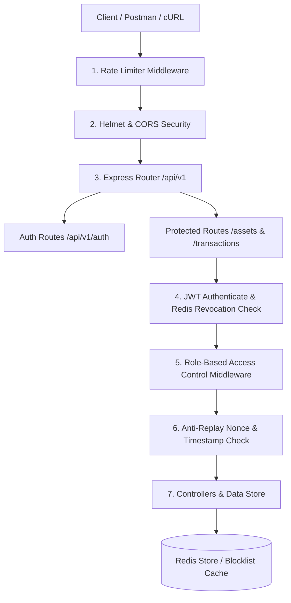

## Digiryte Technical Challenge - Secure & Scalable REST API

**Candidate:** Santhosh VS  
**Assessment:** Round 3 Technical Challenge — Challenge 1 (Secure, Scalable API)  
**Evaluator:** Karthik Kumar, CTO, Digiryte  
**Date:** September 2026  

---

### 🚀 Overview

This repository contains a production-grade, secure REST API built with **Node.js**, **Express**, and **TypeScript**. It is designed around real-world security practices, demonstrating token-based authentication with active revocation, fine-grained Role-Based Access Control (RBAC), anti-replay attack protection on sensitive financial endpoints, strict server-side validation, rate-limiting, and environment secret isolation.

---

### 🛠 Tech Stack

- **Runtime & Framework:** Node.js (v20+), Express.js, TypeScript (v5+)
- **Authentication:** JSON Web Tokens (`jsonwebtoken`), `bcryptjs`
- **Cache & Blocklist:** Redis (`ioredis`) with automatic in-memory fallback for local development
- **Security & Middlewares:** `helmet`, `cors`, `express-rate-limit`
- **Validation & Sanitization:** `zod` schema parsing & string HTML sanitization
- **Testing Suite:** `Jest`, `Supertest`
- **Deployment:** Render (`render.yaml`), Vercel (`vercel.json`)

---

### 🏗 Architecture & Request Flow



---

### 🔒 Key Security Features Implemented

#### 1. Dual-Token JWT Auth Pattern & Active Revocation
- **Access Tokens:** Short-lived (15 minutes) carrying user ID, email, role, and a unique JWT ID (`jti`).
- **Refresh Tokens:** Long-lived (7 days) for seamless token renewal.
- **Token Revocation (Logout / Compromise Scenario):** Upon invoking `POST /api/v1/auth/logout`, the server extracts the token's `jti` and commits it to a Redis blocklist (`token:revoked:<jti>`) with a TTL equal to the token's remaining lifespan. Any subsequent attempt to present a revoked access token is immediately rejected with HTTP `401 TOKEN_REVOKED` before reaching business logic.

#### 2. Role-Based Access Control (RBAC)
- Enforces two distinct roles: `USER` and `ADMIN`.
- **Permissions Grid:**
  | Endpoint | `USER` Permission | `ADMIN` Permission |
  | :--- | :--- | :--- |
  | `GET /api/v1/assets` | Views only assets owned by self | Views all assets system-wide across all users |
  | `POST /api/v1/assets` | Creates asset assigned to self | Can create/assign asset to any specified user |
  | `DELETE /api/v1/assets/:id` | Can delete **only** assets owned by self (HTTP 403 otherwise) | Can delete **any** asset across the platform |

#### 3. Replay-Attack Defense (Sensitive Endpoint)
- Applied to `POST /api/v1/transactions/transfer`.
- **Mechanism:**
  - Client must send custom security headers: `X-Nonce` (UUID) and `X-Timestamp` (epoch ms / ISO).
  - Server verifies timestamp freshness (must be within $\pm5$ minutes of server time).
  - Server executes an atomic Redis command `SET key value EX 300 NX` using `nonce:<X-Nonce>`.
  - If a attacker captures and replays the request, the second call fails at the middleware layer with HTTP `409 REPLAY_ATTACK_DETECTED`.

#### 4. Input Validation & Sanitization
- All request parameters, bodies, and headers are validated using strict **Zod** schemas.
- String fields undergo HTML tag stripping to prevent XSS / injection attacks.
- Invalid requests return structured RFC7807 error responses with specific field-level validation breakdowns.

#### 5. Rate Limiting
- **Global Rate Limiter:** 100 requests per 15-minute window per IP.
- **Sensitive Rate Limiter:** Tighter rate limiting (10 requests/min) on `/auth/login`, `/auth/refresh`, and `/transactions/transfer`.

---

### 💻 Local Development Setup

#### 1. Prerequisites
- Node.js (v18.x or higher)
- npm (v9.x or higher)
- Optional: Running Redis server (if Redis is not running locally, the application automatically logs a warning and degrades gracefully to an in-memory cache adapter for local testing).

#### 2. Installation
```bash
# Clone repository
git clone <your-repo-link>
cd digiryte-challenge-01

# Install dependencies
npm install
```

#### 3. Environment Setup
Copy the example environment file:
```bash
cp .env.example .env
```

Default `.env` configuration:
```env
PORT=4000
NODE_ENV=development
JWT_SECRET=super-secret-access-token-key-change-in-production-min-32-chars
JWT_REFRESH_SECRET=super-secret-refresh-token-key-change-in-production-min-32-chars
JWT_ACCESS_EXPIRATION=15m
JWT_REFRESH_EXPIRATION=7d
REDIS_URL=redis://localhost:6379
REPLAY_NONCE_TTL_SECONDS=300
REPLAY_MAX_TIMESTAMP_DIFF_SECONDS=300
```

#### 4. Running the Application
```bash
# Run in development mode (hot reloading via tsx)
npm run dev

# Run automated tests (Supertest + Jest)
npm test

# Build for production
npm run build

# Start production build
npm start
```

---

### 🧪 Verification & Automated Tests

The repository includes comprehensive automated integration tests covering all technical evaluation criteria:

```bash
npm test
```

**Test Coverage Highlights:**
- ✅ User Registration & Login JWT issue
- ✅ Access token invalidation on Logout (Token Revocation assertion)
- ✅ RBAC checks (User restricted from deleting others' assets; Admin permitted)
- ✅ Anti-Replay Defense (Validating `X-Nonce` single-use enforcement)
- ✅ Input validation schema errors (HTTP 400 response structure)

---

### 📡 API Endpoint Reference & Testing Guide

#### Seeded Credentials for Testing
- **Regular User:** `email: user@example.com` | `password: Password123!` | Role: `USER`
- **System Admin:** `email: admin@example.com` | `password: Password123!` | Role: `ADMIN`

---

#### 1. Authentication Endpoints

#### Register New User
```bash
curl -X POST http://localhost:4000/api/v1/auth/register \
  -H "Content-Type: application/json" \
  -d '{
    "email": "dev@example.com",
    "password": "Password123!",
    "name": "Alex Dev",
    "role": "USER"
  }'
```

#### Login
```bash
curl -X POST http://localhost:4000/api/v1/auth/login \
  -H "Content-Type: application/json" \
  -d '{
    "email": "user@example.com",
    "password": "Password123!"
  }'
```

#### Logout (Revokes Access Token in Redis)
```bash
curl -X POST http://localhost:4000/api/v1/auth/logout \
  -H "Authorization: Bearer <ACCESS_TOKEN>"
```

---

#### 2. RBAC Asset Endpoints

#### List Assets (Role Dependent Output)
```bash
# Using User Token -> Returns 1 user-owned asset
curl -X GET http://localhost:4000/api/v1/assets \
  -H "Authorization: Bearer <USER_ACCESS_TOKEN>"

# Using Admin Token -> Returns all system assets
curl -X GET http://localhost:4000/api/v1/assets \
  -H "Authorization: Bearer <ADMIN_ACCESS_TOKEN>"
```

#### Delete Asset (RBAC Enforced)
```bash
# User attempting to delete Admin asset (ast_2) -> Returns HTTP 403 Forbidden
curl -X DELETE http://localhost:4000/api/v1/assets/ast_2 \
  -H "Authorization: Bearer <USER_ACCESS_TOKEN>"

# Admin deleting asset ast_1 -> Returns HTTP 200 OK
curl -X DELETE http://localhost:4000/api/v1/assets/ast_1 \
  -H "Authorization: Bearer <ADMIN_ACCESS_TOKEN>"
```

---

#### 3. Replay Defense Endpoint

#### Execute Financial Transfer (Requires Single-Use Nonce)
```bash
# Generate fresh nonce and timestamp
NONCE=$(uuidgen)
TIMESTAMP=$(date +%s%3N)

# 1st Request -> Success (201 Created)
curl -X POST http://localhost:4000/api/v1/transactions/transfer \
  -H "Authorization: Bearer <USER_ACCESS_TOKEN>" \
  -H "X-Nonce: ${NONCE}" \
  -H "X-Timestamp: ${TIMESTAMP}" \
  -H "Content-Type: application/json" \
  -d '{
    "recipientId": "usr_admin_1",
    "amount": 150.00,
    "currency": "USD"
  }'

# 2nd Request (Replaying exact same request) -> Rejected (409 Conflict: REPLAY_ATTACK_DETECTED)
curl -X POST http://localhost:4000/api/v1/transactions/transfer \
  -H "Authorization: Bearer <USER_ACCESS_TOKEN>" \
  -H "X-Nonce: ${NONCE}" \
  -H "X-Timestamp: ${TIMESTAMP}" \
  -H "Content-Type: application/json" \
  -d '{
    "recipientId": "usr_admin_1",
    "amount": 150.00,
    "currency": "USD"
  }'
```

---

## 🌐 Live Deployment Instructions

### Option A: Render Deployment
This repository contains a pre-configured [`render.yaml`](file:///Users/sandy/Santhosh/Internship_Trainee/Digiryte%20UK/digiryte-challenge-01/render.yaml) Blueprint file.
1. Connect your GitHub repository to Render.
2. Select **New Blueprint Instance**.
3. Render automatically provisions the Express Web Service and managed Redis instance.
4. Set required secrets (`JWT_SECRET`, `JWT_REFRESH_SECRET`) in the Render Dashboard environment settings.

### Option B: Vercel Deployment
This repository contains a pre-configured [`vercel.json`](file:///Users/sandy/Santhosh/Internship_Trainee/Digiryte%20UK/digiryte-challenge-01/vercel.json) file.
1. Import repository to Vercel.
2. Set Environment Variables (`JWT_SECRET`, `JWT_REFRESH_SECRET`, `REDIS_URL` using an Upstash Redis or Redis Cloud connection string).
3. Deploy!

---

## 📌 Assumptions Made

1. **Redis Fallback:** In local environments without an active Redis instance, the application switches to an in-memory cache implementation to prevent local boot crashes while maintaining full feature parity for developer testing. In production, a live Redis instance (e.g. Render Redis / Upstash) is recommended.
2. **Replay Window:** The maximum allowable clock skew for transaction timestamps is set to 300 seconds (5 minutes) by default via `REPLAY_MAX_TIMESTAMP_DIFF_SECONDS`.
3. **Role System:** The RBAC model demonstrates core user hierarchy using `USER` and `ADMIN` roles. The middleware is extensible for custom role permissions (`MANAGER`, `AUDITOR`, etc.).

---


**Santhosh VS**  
Digiryte Technical Challenge Candidate  
`Prepared for Karthik Kumar, CTO, Digiryte`
